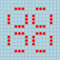

# Formative assignment 1

## Instructions

* If you have not yet cloned the module Gitlab repository, then do that with:
  ```shell
  git clone https://git.cs.bham.ac.uk/zeilbern/fp-learning-2019-2020.git
  ```
  If you've already cloned the repository, run
  ```shell
  git pull
  ```
  to ensure that you have the most recent version including this assignment.

* Go into the "Assignments/Formative/Formative1" directory and *copy* the given `Formative1-template.hs` to a *new* file `Formative1.hs`.
  Work on that file to produce your solution and then submit it to Canvas.

  It is important to copy the file as explained, since any future `git pull` may overwrite the template. Hence don't work directly on the template.

* Be aware that:

  * Your solutions must work with GHC 8.6.5. To use GHC 8.6.5 on a lab machine, see [HardwareAndSoftware.md](../../Resources/HardwareAndSoftware.md).

  * If you wish to import modules, then you may only import libraries from [the standard library](http://hackage.haskell.org/package/base). Additionally, all modules you import must be "Safe" on Hackage.

  * **The questions are in roughly increasing order of difficulty.**  You should try all of them, but IT IS OKAY IF YOU DON'T FIND SOLUTIONS TO ALL THE QUESTIONS.

## Questions

These questions build on the [Game of Life lecture](../../LectureNotes/Life.md), in particular the following definitions:

```haskell
type Cell = (Int,Int)
type Grid = [Cell]

isLive, isDead :: Cell -> Grid -> Bool
isLive c g = c `elem` g
isDead c g = not (isLive c g)

neighbours :: Cell -> [Cell]
neighbours (x,y) = [ (x+i,y+j) | i <- [-1..1], j <- [-1..1], not (i==0 && j==0) ]

liveNeighbours :: Grid -> Cell -> [Cell]
liveNeighbours g c = [c' | c' <- neighbours c, isLive c' g]

step :: Grid -> Grid
step [] = []
step g =
  [(x,y) | x <- [minX-1 .. maxX+1],
           y <- [minY-1 .. maxY+1],
              (isDead (x,y) g && length (liveNeighbours g (x,y)) == 3)
           || (isLive (x,y) g && length (liveNeighbours g (x,y)) `elem` [2,3])
         ]
  where
    minX = minimum [ x | (x,y) <- g ]
    maxX = maximum [ x | (x,y) <- g ]
    minY = minimum [ y | (x,y) <- g ]
    maxY = maximum [ y | (x,y) <- g ]
```

For testing purposes, you might also find it useful to consider the following seeds referenced in the notes:
```haskell
pentagenarian, glider, block, pulsar :: Grid
pentagenarian = [(1,2),(2,2),(2,3),(4,1),(4,3)]
glider = [(1,3),(2,1),(2,3),(3,2),(3,3)]
block = [(x,y) | x <- [1..3], y <- [1..3]]
pulsar = [(x+i,y) | x <- [2,8], y <- [0,5,7,12], i <- [0..2]] ++ [(x,y+i) | x <- [0,5,7,12], y <- [2,8], i <- [0..2]]
```

1. Write a function `translate` which takes a pair of integers (m,n) and a grid g, and returns a new grid where all the live cells of g have been shifted right by m in their x-coordinate and up by n in their y-coordinate.
   ```haskell
   translate :: (Int,Int) -> Grid -> Grid
   translate (m,n) g = undefined
   ```
   (You should replace the "undefined" above by an appropriate expression.)

2. Since [Life is Turing-complete](http://www.conwaylife.com/wiki/Turing_machine), there is no algorithm for deciding whether or not an arbitrary seed eventually dies out, or for determining the lifetime of a seed. Still, both these problems can be addressed by [semi-algorithms](https://en.wikipedia.org/wiki/RE_(complexity)).
   * Write a function
     ```haskell
     isMortal :: Grid -> Bool
     isMortal g = undefined
     ```
     that returns `True` if the grid g eventually dies out.
     In the case that g is immortal, then `isMortal` is allowed to either return `False` or loop.
   * Write a function
     ```haskell
     lifetime :: Grid -> Maybe Int
     lifetime g = undefined
     ```
     that returns `Just n` if the grid g dies out after exactly n steps *and not sooner*.
     In the case that g is immortal, then `lifetime` is allowed to either return `Nothing` or loop.

3. A grid g is said to have **period k** (where k is a positive integer) just in case it evolves back to itself in k steps.
   For example, the pulsar pattern has period 3.

   0 
   1 
   2 
   3 

   Write a function
   ```haskell
   hasPeriod :: Grid -> Int -> Bool
   hasPeriod g k = undefined
   ```
   that returns `True` just in case the grid g has period k, and `False` otherwise.
   It will be helpful to make use of the following function:
   ```haskell
   sameGrid :: Grid -> Grid -> Bool
   sameGrid g1 g2 = sort g1 == sort g2
   ```
   which checks whether two lists of cells represent the same grid by testing that they are permutations of each other (here `sort` is a sorting routine imported from `Data.List`).

4. A grid is said to be **periodic** just in case it has period k for some k>0.
   A grid is said to be **eventually periodic** just in case it evolves in some number of steps n to a periodic grid.

   As with testing whether a grid eventually dies, there is no computable algorithm for deciding whether an arbitrary grid is eventually periodic, but it is still possible to write a semi-decision procedure.

   * Write a function
     ```haskell
     eventuallyPeriodic :: Grid -> Bool
     eventuallyPeriodic g = undefined
     ```
     that returns `True` just in case g is eventually periodic. In the case that g is not eventually periodic, then `eventuallyPeriodic` is allowed to either return `False` or loop.

   * Write a function
     ```haskell
     findEventualPeriod :: Grid -> Maybe (Int,Int)
     findEventualPeriod g = undefined
     ```
     that returns `Just (n,k)` just in case g evolves in n steps *and not sooner* to a periodic grid, and that grid has period k *and no smaller period*.
     In the case that g is not eventually periodic, `findEventualPeriod` should either return `Nothing` or loop.
