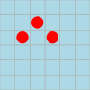
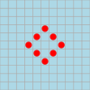
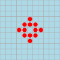
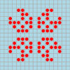
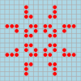
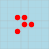
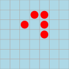

# Haskell Life 

In this lecture we will discuss a self-contained program that has many features that we will study in the next few lectures. Don't worry if you don't understand everything.

# Contents

* [Background](#background)
  * [Rules](#rules)
  * [Examples](#examples)
* [Implementing Conway's Game of Life](#implementation)
  * [Representing the board and step function](#boardstep)
  * [Visualising the game, take #1](#visualisation1)
  * [Visualising the game, take #2](#visualisation2)
  * [Visualising the game, take #3](#visualisation3)
* [An implementation in Kotlin](#kotlin)

<a name="background"></a>
# Background

The game ["Life"](https://en.wikipedia.org/wiki/Conway's_Game_of_Life), invented by [John Conway](https://www.youtube.com/watch?v=E8kUJL04ELA), was an early example of a cellular automaton with complex behaviors generated from a simple set of rules.

<a name="rules"></a>
## Rules

The Life game begins by placing some tokens on the cells of a two-dimensional grid.
Cells of the grid that contain a token are said to be "live", while empty cells are said to be "dead".
Each cell has exactly eight neighbours, corresponding to the cells that are immediately adjacent horizontally, vertically, or diagonally.

The initial configuration is called the *seed*, or generation 0.
Afterwards the game is played deterministically according to the following rules of evolution whereby a cell interacts with its neighbours:

1. [Birth.] A dead cell with exactly three live neighbours becomes live at the next generation.
2. [Survival.] A live cell with either two or three live neighbours survives to the next generation.
3. [Death.] A cell dies from overcrowding if it has more than three live neighbours, or from isolation if it has fewer than two neighbours.

It is important to clarify that the rules specify that all of these births and deaths happen *simultaneously* as the grid evolves into the next generation, rather than in any particular order.

<a name="examples"></a>
## Examples

Many initial configurations quickly die off.
For example, the seed


evolves to an empty grid after five generations.
(Since an empty grid can never be repopulated, all generations after generation 5 are the same.)

0 
1 
2 
3 

4 
5 
6 
7 

On the other hand, some seeds enter into a stable pattern of oscillation between a collection of two or more states.

0 
1 
2 
3 

4 
5 
6 
7 

---

0 
1 
2 
3 

4 
5 
6 
7 

Another interesting example is Conway's "glider" pattern, which moves slowly across the board, drifting up and to the right by one square every four generations.

0 
1 
2 
3 

4 
5 
6 
7 

It turns out that behaviors in Life can get arbitrarily complicated &mdash; indeed it is possible to [simulate a Turing machine](https://www.youtube.com/watch?v=My8AsV7bA94) by encoding it as an initial seed and watching it evolve!

<a name="implementation"></a>
# Implementing Conway's Game of Life

Now let's see how to translate the rules of Life into a simple Haskell implementation.
We will develop all of the code that we need right here in these [markdown](https://en.wikipedia.org/wiki/Markdown) notes, which can be converted into a Haskell file automatically by running the program [`mdtohs.hs`](../Resources/mdtohs.hs) as follows:
```
$ cat Life.md | runhaskell ../Resources/mdtohs.hs > Life.hs
```
assuming you are in the directory `LectureNotes`.

Soon we will want to animate the game, and so we need to include the following import to use a builtin delay function:
```haskell
import Control.Concurrent
```
Later on, we will want to generate diagrams using the [diagrams library](https://archives.haskell.org/projects.haskell.org/diagrams/), so we also include the following imports here:
```haskell
import Diagrams.Prelude
import Diagrams.Backend.SVG
```
(Note that besides these libraries, the Haskell [Standard Prelude](https://www.haskell.org/onlinereport/standard-prelude.html) is automatically imported into the environment.)

With that bureaucracy out of the way, let's turn to the more substantive question of how to represent the state of the game.

<a name="boardstep"></a>
## Representing the board and step function

One way we might think of representing the grid is as a two-dimensional array of booleans with some fixed number of rows and columns.
However, this representation has a couple disadvantages:

* The official Life rules don't put any bound on the size of the grid, and there are patterns (such as the glider) which eventually travel through an infinite region of cells.
* Typical grid configurations are *sparse* in the sense that most of the cells are empty.

To avoid these issues, we will instead represent a grid by just keeping track of the *live* cells.
So let us make the following **type declarations**:

```haskell
type Cell = (Int,Int)
type Grid = [Cell]
```

This defines the type `Cell` as a synonym for "pair of machine integers", and the type `Grid` as a synonym for "list of cells" (= list of pairs of machine integers).
The intended interpretation is that a cell is specified by giving its (x,y) coordinates, while a grid is specified by listing (the coordinates of) its live cells.
For example, the grids


&nbsp;&nbsp;&nbsp; and &nbsp;&nbsp;&nbsp;


are represented by the following lists of coordinates:

```haskell
pentagenarian :: Grid
pentagenarian = [(1,2),(2,2),(2,3),(4,1),(4,3)]

glider :: Grid
glider = [(1,3),(2,1),(2,3),(3,2),(3,3)]
```

Now that we've settled on the representation, let's go ahead and implement the rules of Life.
We begin with several helper functions.
```haskell
isLive, isDead :: Cell -> Grid -> Bool
isLive c g = c `elem` g
isDead c g = not (isLive c g)
```
The functions `isLive` and `isDead` determine whether or not the cell at coordinate c is live in a given grid g: since the grid is represented as a list of live cells, this simply reduces to checking whether or not c is an element of g.

```haskell
neighbours :: Cell -> [Cell]
neighbours (x,y) = [ (x+i,y+j) | i <- [-1..1], j <- [-1..1], not (i==0 && j==0) ]
```

The function `neighbours` returns the list of eight neighbours of a given cell.
A first aspect of this definition it is worth pointing out is the use of **pattern matching** on the left-hand side
```hs
neighbours (x,y) = {- ... -}
```
to automatically give names to the two components of the cell coordinate.
This definition can be equivalently expressed using destructors and `let` bindings
```hs
neighbours c = let x = fst c in let y = snd c in {- ... -}
```
but the definition via pattern-matching is more clear and concise.
Another aspect of this definition worth pointing out is the use of a **list comprehension**
```hs
{- ... -} = [ (x+i,y+j) | i <- [-1..1], j <- [-1..1], not (i==0 && j==0) ]
```
on the right-hand side.
List comprehensions are a powerful feature of Haskell that mimic set comprehension notation in mathematics.
The expression above constructs a list of pairs of the form (x+i,y+j), where i and j run from -1 to 1, but cannot both be equal to 0.
(You can read more about pattern matching and list comprehension in Chapters 4 and 5 of [the textbook](http://www.cs.nott.ac.uk/~pszgmh/pih.html).)
Here is a sample output of `neighbours`, running within the GHC interpreter:
```hs
> neighbours (2,2)
[(1,1),(1,2),(1,3),(2,1),(2,3),(3,1),(3,2),(3,3)]
```
By combining `neighbours` with `isLive` using another list comprehension, we can compute the live neighbours of a cell within a given grid:

```haskell
liveNeighbours :: Grid -> Cell -> [Cell]
liveNeighbours g c = [c' | c' <- neighbours c, isLive c' g]
```

Sample outputs:

```hs
> liveNeighbours pentagenarian (2,2)
[(1,2),(2,3)]
> liveNeighbours glider (2,2)
[(1,3),(2,1),(2,3),(3,2),(3,3)]
```

Finally, we combine these ingredients to write a function `step`, which takes a grid as input and applies the rules of Life to compute the next generation grid as output.

```haskell
step :: Grid -> Grid
step [] = []
step g =
  [(x,y) | x <- [minX-1 .. maxX+1],
           y <- [minY-1 .. maxY+1],
              (isDead (x,y) g && length (liveNeighbours g (x,y)) == 3)
           || (isLive (x,y) g && length (liveNeighbours g (x,y)) `elem` [2,3])
         ]
  where
    minX = minimum [ x | (x,y) <- g ]
    maxX = maximum [ x | (x,y) <- g ]
    minY = minimum [ y | (x,y) <- g ]
    maxY = maximum [ y | (x,y) <- g ]
```

The first clause of the definition
```hs
step [] = []
```
simply repeats the already mentioned fact that an empty grid can never be repopulated.
The second clause is a bit more subtle so it's worth spending some time to understand it.
We begin by computing the minimum/maximum values obtained for the x and y coordinates of all of the live cells of the grid.
(This all happens in the `where` block, which is evaluated first even though it occurs syntactically below the list comprehension.)
Since the live cells of the next generation must all be within distance one from the live cells of the current generation, it suffices to consider the rectangle of cells (x,y) ranging from the lower left corner (minX-1,minY-1) to the upper right corner (maxX+1,maxY+1) (see shaded region in the diagram below).


For all of the cells lying within this region, we then test the boolean formula
```hs
              (isDead (x,y) g && length (liveNeighbours g (x,y)) == 3)
           || (isLive (x,y) g && length (liveNeighbours g (x,y)) `elem` [2,3])
```
which directly expresses the logic of "birth" or "survival": a dead cell becomes live in the next generation if it has exactly three neighbours, while a live cell survives if it has either two or three neighbours.
(The logic of "death" is also implicitly encapsulated by the formula, since a cell with more than three or fewer than two live neighbours will be excluded from the list of live cells in the next generation.)

Here is a sample interaction with the `step` function:

```hs
> step pentagenarian
[(1,2),(1,3),(2,2),(2,3),(3,3)]
> step (step pentagenarian)
[(1,2),(1,3),(2,4),(3,2),(3,3)]
> step (step (step pentagenarian))
[(1,3),(2,4),(3,3)]
> step (step (step (step pentagenarian)))
[(2,3),(2,4)]
> step (step (step (step glider)))
[(2,4),(3,2),(3,4),(4,3),(4,4)]
```

One last remark: in the definition of `step`, it is important that the clause
```hs
step [] = []
```
appears before the clause
```hs
step g = {- ... -}
```
to cover the case of the empty grid.
Otherwise the implementation would be incorrect, since the operations `minimum` and `maximum` raise an exception in the case of an empty list.

<a name="visualisation1"></a>
## Visualising the game, take #1

We will animate the game in a terminal, using [Ansi escape code](https://en.wikipedia.org/wiki/ANSI_escape_code).

Firstly we will assume the following dimensions for our terminal (change for testing, if needed):
```haskell
terminalWidth  = 70
terminalHeight = 22
```

For programs that do input and output, we must use the `IO ()`
type. The Ansi escape code `\ESC[2J` is for clearing the terminal:
```haskell
cls :: IO ()
cls = putStr "\ESC[2J"
```

If we want to print a character in a certain position of the terminal, we need to move the cursor there with the Ansi escape code `\Esc[` followed by two numbers separated by `;` and ended by `H`.
```haskell
goto :: Cell -> IO ()
goto (x,y) = putStr ("\ESC[" ++ show (terminalHeight-y) ++ ";" ++ show (x+1) ++ "H")
```
Here we subtracted `y` from the terminal height because we use the convention that rows of the board are numbered from bottom to top, whereas rows of the terminal are numbered from top to bottom.
We also added 1 to `x` because we want board position (0,0) to correspond to the bottom-left position of the terminal.

We will print an "O" to represent a live cell:
```haskell
printCell :: Cell -> IO ()
printCell (x,y) | x >= 0 && x < terminalWidth
               && y >= 0 && y < terminalHeight = do
                                                  goto (x,y)
                                                  putChar 'O'

                | otherwise                    = return ()
```
A warning is that the `IO`-type's `return` function is not like `Java`'s return. We will see what `return` means when we study monads later. For the moment, we just state its type:
```hs
return :: Monad m => a -> m a
```
Observe that `return` has a *polymorphic* type since `m` and `a` are variables.
Here we are using it with the monad `m = IO` and type `a = ()`.

Finally, we render a grid in the terminal as follows:
```haskell
terminalRender :: Grid -> IO ()
terminalRender g = do
                    cls
                    sequence [ printCell c | c <- g ]
                    goto (0,terminalHeight)
```
The Haskell prelude function `sequence` performs a sequence of `IO` operations in this case, and a sequence of monadic operations in general, and has the following type:
```hs
sequence :: (Traversable t, Monad m) => t (m a) -> m (t a)
```
Here we are using it with `t a = [a]` and `m = IO`.

We also need a delay function, for otherwise the evolution of the game is shown too fast (this needs `import Control.Concurrent`):

```haskell
delayTenthSec :: Int -> IO ()
delayTenthSec n = threadDelay (n * 10^5)
```

Finally we can animate the game of life as follows in the terminal:
```haskell
life1 :: Grid -> IO ()
life1 seed = f 0 seed
 where
  f n g = do
           terminalRender g
           putStrLn (show n)
           delayTenthSec 1
           f (n+1) (step g)
```

Example:
```haskell
main :: IO ()
main = life1 glider
```

Run this file as follows from a terminal in a lab machine:
```shell
$ module load func-prog
$ git clone https://git.cs.bham.ac.uk/zeilbern/fp-learning-2019-2020.git
$ cd fp-learning-2019-2020/LectureNotes
$ cat Life.md | runhaskell ../Resources/mdtohs.hs > Life.hs
```
Then run
```shell
$ runhaskell Life.hs
```
Or instead run `ghci Life.hs` and `life1 glider` or `life1 pentagenarian` or other examples.

By the way, the other two initial seeds illustrated in the [Examples](#examples) section can be expressed concisely as follows using list comprehensions:

```haskell
block3 :: Grid
block3 = [(x,y) | x <- [1..3], y <- [1..3]]

pulsar :: Grid
pulsar = [(x+i,y) | x <- [2,8], y <- [0,5,7,12], i <- [0..2]] ++ [(x,y+i) | x <- [0,5,7,12], y <- [2,8], i <- [0..2]]
```

You can go ahead and try running them!

<a name="visualisation2"></a>
## Visualising the game, take #2

The first visualisation has the drawback of being limited by the size of the terminal.
Here we will develop an alternative visualisation of the game that produces unanimated text output, but without any limitations on the size of the board.
The idea is that we will compute in advance the minimal size that the board has to be in order to fit some fixed number of generations of the game.

Before jumping to the code, it's useful to see an example of how to use the Haskell prelude functions `take` and `iterate` to inspect the evolution of a given seed over some number of generations:
```hs
> take 5 (iterate step pentagenarian)
[[(1,2),(2,2),(2,3),(4,1),(4,3)],[(1,2),(1,3),(2,2),(2,3),(3,3)],[(1,2),(1,3),(2,4),(3,2),(3,3)],[(1,3),(2,4),(3,3)],[(2,3),(2,4)]]
```
If you aren't used to Haskell notation, it might be hard to recognise that the output is actually a list of grids (i.e., a *list of lists of pairs of integers*), although thankfully, it is possible to ask the GHC interpreter to tell us the type of any expression:
```hs
> :type take 5 (iterate step pentagenarian)
take 5 (iterate step pentagenarian) :: [Grid]
```
While we're at it, let's also ask for the types of the functions `take` and `iterate` from the standard prelude.
```hs
> :type take
take :: Int -> [a] -> [a]
> :type iterate
iterate :: (a -> a) -> a -> [a]
```
Again these both have polymorphic types, and here we are using them with `a = Grid`.
In general, the function `take` takes a number k and a list xs of elements of arbitrary type, and returns the first k elements of xs.
For example:
```hs
> take 3 [1..5]
[1,2,3]
> take 3 [2,3,5,7,11]
[2,3,5]
```
The function `iterate` is an example of a **higher order function**, which takes as input a function f together with a value x, and returns as output the list of iterations of the function applied to the value (x, f(x), f(f(x)), etc.).
Actually, since the list of all these iterations is infinite, this is really achieved using *laziness*, another special feature of Haskell: successive elements of `iterate f x` are only produced as they are needed in the rest of the computation.
For example, the expression `iterate (*2) 1` symbolically denotes an infinite list (the list of all powers of 2), but we can extract any number of concrete values by wrapping the expression in `take`:
```hs
> let pow2s = iterate (*2) 1
> take 5 pow2s
[1,2,4,8,16]
> take 16 pow2s
[1,2,4,8,16,32,64,128,256,512,1024,2048,4096,8192,16384,32768]
```

Now that you know what `take` and `iterate` mean, you should convince yourself that the expression
```hs
take (n+1) (iterate step seed)
```
computes the first n+1 generations of a Life game, starting from some initial seed (= generation 0) and ending at generation n.

With that out of the way, let's start working on the second visualisation.

We begin by writing a function `printGrid` that takes as input a grid and a pair of coordinates (x1,y1) and (x2,y2), and prints all of the cells that lie within the rectangle whose *lower left corner* is (x1,y1) and whose *upper right corner* is (x2,y2).
Again the output type `IO ()` is needed, because the function produces output to the screen.

```haskell
printGrid :: Grid -> Cell -> Cell -> IO ()
printGrid g (x1,y1) (x2,y2) =
  sequence_ [do
                sequence_ [putStr (if isLive (x,y) g then "O" else ".")
                          | x <- [x1..x2]]
                putStr "\n"
            | y <- reverse [y1..y2]]

```

Some comments on the code:
* The function
  ```hs
  putStr :: String -> IO ()
  ```
  from the standard prelude takes a string and outputs it to the screen
* The function `sequence_` takes a list of commands of type `IO ()` and performs them in order.
* What the code segment
  ```hs
     {- ... -} do
                  sequence_ [putStr (if isLive (x,y) g then "O" else ".")
                  sequence_ [putStr (if isLive (x,y) g then "O" else ".")
                            | x <- [x1..x2]]
                  putStr "\n"
  ```
  does is therefore to print the horizontal sequence of cells from (x1,y) to (x2,y) (writing "O" for live cells and "." for dead cells), followed by a newline.
* The outer `sequence_` in
  ```hs
    sequence_ [{- ... -} | y <- reverse [y1..y2]]
  ```
  does this for each y between y1 and y2, but running in reverse order again because rows of the board are numbered going upwards.

We put `printGrid` into a top-level routine for visualising an entire Life game, starting from an initial seed and running through generation n.

```haskell
life2 :: Grid -> Int -> IO ()
life2 seed n =
  mapM_ (\(g,i) -> do
            putStrLn ("GENERATION " ++ show i)
            printGrid g (minX-1,minY-1) (maxX+1,maxY+1)
        )
    (zip gs [0..n])
  where
    gs = take (n+1) (iterate step seed)
    minX = minimum [x | g <- gs, (x,y) <- g]
    maxX = maximum [x | g <- gs, (x,y) <- g]
    minY = minimum [y | g <- gs, (x,y) <- g]
    maxY = maximum [y | g <- gs, (x,y) <- g]
```
Reading from the top of the `where` block, the routine begins by computing the n successive generations of the initial seed (`gs`), using the logic explained above.
Then it calculates the extremal values of the x and y coordinates of live cells running over all of these generations (`minX`, `maxX`, `minY`, `maxY`).
These bounds (with an extra unit of buffer space) are later used in all calls to `printGrid` &mdash; the idea is to figure out in advance what is the minimal size board that will permit a visualisation of all of the action over the course of the game without hiding any live cells.

Finally, the higher-order function `mapM_` is used to iterate the function
```hs
         \(g,i) -> do
            putStrLn ("GENERATION " ++ show i)
            printGrid g (minX-1,minY-1) (maxX+1,maxY+1)
```
over the list of successive generations of grids paired with their labels.
A few more comments:

* The polymorphic function
  ```hs
  zip :: [a] -> [b] -> [(a, b)]
  ```
  takes two lists and returns a list of pairs by pairing off successive elements (e.g., `zip ["one","two","three"] [1..3]` evaluates to `[("one",1),("two",2),("three",3)]`).
* The polymorphic function
  ```hs
  (++) :: [a] -> [a] -> [a]
  ```
  denotes list concatenation.
  In Haskell, this implements string concatenation as a special case since the type `String` is a synonym for `[Char]`.
* The operation `show` is used to format an integer into a string. (As you will learn later, more generally `show` can be used to turn any instance of the *typeclass* `Show` into a string.)
* The command `putStrLn` works just like `putStr` but prints an extra newline.

Let's try out the new visualisation on a few examples:

```hs
> life2 pentagenarian 7
GENERATION 0
......
......
..O.O.
.OO...
....O.
......
GENERATION 1
......
......
.OOO..
.OO...
......
......
GENERATION 2
......
..O...
.O.O..
.O.O..
......
......
GENERATION 3
......
..O...
.O.O..
......
......
......
GENERATION 4
......
..O...
..O...
......
......
......
GENERATION 5
......
......
......
......
......
......
GENERATION 6
......
......
......
......
......
......
GENERATION 7
......
......
......
......
......
......
> life2 glider 7
GENERATION 0
.......
.......
.......
.OOO...
...O...
..O....
.......
GENERATION 1
.......
.......
..O....
..OO...
.O.O...
.......
.......
GENERATION 2
.......
.......
..OO...
.O.O...
...O...
.......
.......
GENERATION 3
.......
.......
..OO...
...OO..
..O....
.......
.......
GENERATION 4
.......
.......
..OOO..
....O..
...O...
.......
.......
GENERATION 5
.......
...O...
...OO..
..O.O..
.......
.......
.......
GENERATION 6
.......
...OO..
..O.O..
....O..
.......
.......
.......
GENERATION 7
.......
...OO..
....OO.
...O...
.......
.......
.......
> life2 pulsar 7
GENERATION 0
.................
.................
....OOO...OOO....
.................
..O....O.O....O..
..O....O.O....O..
..O....O.O....O..
....OOO...OOO....
.................
....OOO...OOO....
..O....O.O....O..
..O....O.O....O..
..O....O.O....O..
.................
....OOO...OOO....
.................
.................
GENERATION 1
.................
.....O.....O.....
.....O.....O.....
.....OO...OO.....
.................
.OOO..OO.OO..OOO.
...O.O.O.O.O.O...
.....OO...OO.....
.................
.....OO...OO.....
...O.O.O.O.O.O...
.OOO..OO.OO..OOO.
.................
.....OO...OO.....
.....O.....O.....
.....O.....O.....
.................
GENERATION 2
.................
.................
....OO.....OO....
.....OO...OO.....
..O..O.O.O.O..O..
..OOO.OO.OO.OOO..
...O.O.O.O.O.O...
....OOO...OOO....
.................
....OOO...OOO....
...O.O.O.O.O.O...
..OOO.OO.OO.OOO..
..O..O.O.O.O..O..
.....OO...OO.....
....OO.....OO....
.................
.................
GENERATION 3
.................
.................
....OOO...OOO....
.................
..O....O.O....O..
..O....O.O....O..
..O....O.O....O..
....OOO...OOO....
.................
....OOO...OOO....
..O....O.O....O..
..O....O.O....O..
..O....O.O....O..
.................
....OOO...OOO....
.................
.................
GENERATION 4
.................
.....O.....O.....
.....O.....O.....
.....OO...OO.....
.................
.OOO..OO.OO..OOO.
...O.O.O.O.O.O...
.....OO...OO.....
.................
.....OO...OO.....
...O.O.O.O.O.O...
.OOO..OO.OO..OOO.
.................
.....OO...OO.....
.....O.....O.....
.....O.....O.....
.................
GENERATION 5
.................
.................
....OO.....OO....
.....OO...OO.....
..O..O.O.O.O..O..
..OOO.OO.OO.OOO..
...O.O.O.O.O.O...
....OOO...OOO....
.................
....OOO...OOO....
...O.O.O.O.O.O...
..OOO.OO.OO.OOO..
..O..O.O.O.O..O..
.....OO...OO.....
....OO.....OO....
.................
.................
GENERATION 6
.................
.................
....OOO...OOO....
.................
..O....O.O....O..
..O....O.O....O..
..O....O.O....O..
....OOO...OOO....
.................
....OOO...OOO....
..O....O.O....O..
..O....O.O....O..
..O....O.O....O..
.................
....OOO...OOO....
.................
.................
GENERATION 7
.................
.....O.....O.....
.....O.....O.....
.....OO...OO.....
.................
.OOO..OO.OO..OOO.
...O.O.O.O.O.O...
.....OO...OO.....
.................
.....OO...OO.....
...O.O.O.O.O.O...
.OOO..OO.OO..OOO.
.................
.....OO...OO.....
.....O.....O.....
.....O.....O.....
.................
```

One nice feature of this way of visualising the Life game is that it makes clear that only the *relative* coordinates of the live cells really matter, and not their absolute coordinates.
For example, suppose we define another version of the glider shifted over to the right by 10 units:

```haskell
glider' :: Grid
glider' = [(11,3),(12,1),(12,3),(13,2),(13,3)]
```

As you can verify, running `life2 glider' 7` will produce exactly the same output as `life2 glider 7`.

<a name="visualisation3"></a>
## Visualising the game, take #3

It is quite easy to modify our last text-based visualisation to produce vector graphics using the [diagrams library](https://archives.haskell.org/projects.haskell.org/diagrams/gallery.html) for Haskell.
Here is the code:
```haskell
board :: Cell -> Cell -> Diagram B
board (x1,y1) (x2,y2) =
  position [(p2 (fromIntegral x,fromIntegral y), cell)
           | x <- [x1..x2], y <- [y1..y2]]
  where
    cell = square 1 # fc lightblue # lc darkgray

tokens :: Grid -> Diagram B
tokens g =
  position [(p2 (fromIntegral x,fromIntegral y), token)
           | (x,y) <- g]
  where
    token = circle 0.4 # fc red # lw none

life3 :: Grid -> Int -> String -> IO ()
life3 seed n basename =
  mapM_ (\(g,i) ->
            renderSVG (basename ++ show i ++ ".svg") (mkWidth 100)
                (tokens g `atop` board (minX-1,minY-1) (maxX+1,maxY+1)))
    (zip gs [0..n])
  where
    gs = take (n+1) (iterate step seed)
    minX = minimum [x | g <- gs, (x,y) <- g]
    maxX = maximum [x | g <- gs, (x,y) <- g]
    minY = minimum [y | g <- gs, (x,y) <- g]
    maxY = maximum [y | g <- gs, (x,y) <- g]
```
You do not have to follow all the details here, but in case you are curious here are some comments:

* `Diagram B` is a type defined internally by the diagrams library to represent abstract diagrams that can be rendered into vector graphics.
* The helper function `board` produces a diagram representing the underlying grid, with a rectangle of cells ranging from lower left corner (x1,y1) to upper right corner (x2,y2).
* The helper function `tokens` produces a diagram representing all of the live cells of the grid.
* The expression `square 1` creates a square of side length 1, and similarly, the expression `circle 0.4` creates a circle of radius 0.4.  The operations `fc`, `lc`, and `lw` are used to set the fill color, line color, and line width, respectively.
* The diagrams library routine `position` takes a list of diagrams paired with coordinates and positions the diagrams at the given coordinates.
* The operation `fromIntegral` converts from machine integers to floating point numbers, since `p2` takes a pair of floating point numbers as input to specify a 2-dimensional coordinate.
* The function `life3` looks almost exactly the same as `life2` above, except that rather than calling `printGrid` it calls `renderSVG` with a diagram composed by combining the board and tokens.  This has the effect of rendering the diagram into an [SVG](https://en.wikipedia.org/wiki/Scalable_Vector_Graphics) file, with a separate file for every grid generation (we gave `life3` an extra argument `basename` in order to name all of these files with a common prefix).

The following commands can be used to generate all of the images in the [Examples](#examples) section above:
```hs
> life3 pentagenarian 7 "pentagenarian"
> life3 glider 7 "glider"
> life3 block3 7 "block"
> life3 pulsar 7 "pulsar"
```

And here is another example usage, generating the images below:
```hs
> life3 [(1,2),(2,1),(2,2),(2,3),(3,1)] 15 "rpentomino"
```

0 
1 
2 
3 

4 
5 
6 
7 

8 
9 
10 
11 

12 
13 
14 
15 

You can experiment visualising some more [famous examples](https://en.wikipedia.org/wiki/Conway's_Game_of_Life#Examples_of_patterns), or try creating your own seeds!

<a name="kotlin"></a>
# An implementation in Kotlin

[Kotkin](https://developer.android.com/kotlin) is Google's [preferred language for developing Android applications](https://techcrunch.com/2019/05/07/kotlin-is-now-googles-preferred-language-for-android-app-development/).

Kotlin supports functional programming, as illustrated in this [direct translation](../Resources/life.kt) of the Haskell program.
